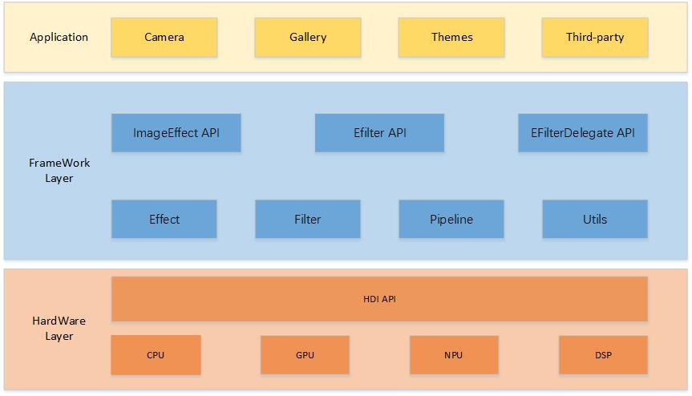

# ImageEffect

- [Introduction](#Introduction)
- [Directory Structure](#Directory-Structure)
- [Compilation](#Compilation)
- [Repositories Involved](#Repositories-Involved)
  
## Introduction
 


**Image** 1 Diagram of the image editing component architecture




## Directory Structure

The structure of the repository directory is as follows:

```
/foundation/multimedia/image_effect      
├── frameworks                           
│   ├── native                          
│   │   └── capi                        
│   │   ├── effect                       
│   │   └── efilter                      
│   │   └── utils                        
├── interfaces                          
│   ├── inner_api                       
│   └── kits                             
├── test                                
│   └── unittest                        
├── BUILD.gn                           
├── bundle.json                          
├── config.gni                           
└── LICENSE                              
```

## Compilation

```
./build.sh --product-name {product-name} --build-target foundation/multimedia/image_effect:image_effect
```

 {product-name} is the currently supported platform, such as rk3568.

## Repositories Involved

[ImageEffect Development Guidance (C/C++)](https://gitee.com/openharmony/docs/blob/master/zh-cn/application-dev/media/image/image-effect-guidelines.md)。
