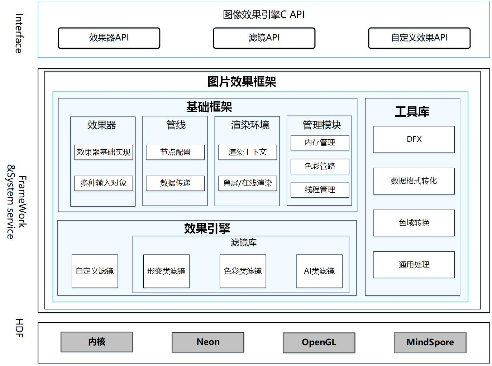

# ImageEffect框架

- [简介](#简介)
  - [基本概念](#基本概念)
- [目录](#目录)
- [编译](#编译)
- [使用说明](#使用说明)
  - [滤镜链处理](#滤镜链处理)
  - [单个滤镜处理](#单个滤镜处理)
  - [自定义滤镜处理](#自定义滤镜处理)

## 简介

图像效果引擎框架提供支持图片编辑业务的开发，开发者可以通过已开放的接口实现图片编辑相关功能的开发。框架提供了单个滤镜处理能力、滤镜链处理能力以及开发者自定义滤镜的处理能力，支持pixelmap、uri、surface等多种输入输出图片数据场景。

**图** 1 图片编辑组件架构图



## 功能介绍
-   滤镜
    开发者可以通过滤镜的接口快速实现基本的效果处理，也可以将滤镜添加到效果器中，组合成滤镜链串联执行。系统提供了如”亮度“、”裁剪“等基本的效果处理滤镜。

-   效果器
    效果器提供了滤镜的添加、删除、查询等功能。开发者可以通过效果器提供的接口将多个滤镜组合串联，从而实现较为复杂的效果调节功能。同时，效果器支持多种输入类型，如pixelmap、uri、surface。不同的输入类型在效果器内部都会转换为内存对象，通过滤镜的效果处理，获得处理结果。

-   自定义效果
    开发者可以使用自定义滤镜实现定制化的滤镜效果，可以将自定义滤镜通过效果器接口添加到效果器中，与其他滤镜组合成滤镜链，也可以只单独使用自定义滤镜处理图片，获得处理效果。

## 目录

仓目录结构如下：

```
/foundation/multimedia/image_effect      # 图片编辑框架业务代码
├── frameworks                           # 框架代码
│   ├── native                           # 内部接口实现
│   │   └── capi                         # 接口实现
│   │   ├── effect                       # 效果类
│   │   └── efilter                      # 效果器实现
│   │   └── utils                        # 工具类
├── interfaces                           # 接口代码
│   ├── inner_api                        # 内部接口
│   └── kits                             # 外部接口
├── test                                 # 测试代码
│   └── unittest                         # 单元测试
├── BUILD.gn                             # 构建配置
├── bundle.json                          # 部件配置
├── config.gni                           # 构建参数配置
└── LICENSE                              # 证书文件
```

## 编译

```
./build.sh --product-name {product-name} --build-target foundation/multimedia/image_effect:image_effect
```

 {product-name}为当前支持的平台，比如rk3568.

## 使用说明

详细的开发指导请参考[ImageEffect开发指导 (C/C++)](https://gitee.com/openharmony/docs/blob/master/zh-cn/application-dev/media/image/image-effect-guidelines.md)。
